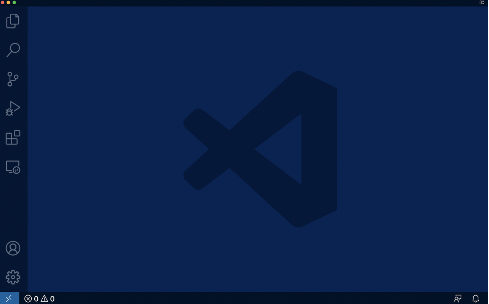

# How to Log Into Course-Specific ieng6 Account
## Step 1: Download **Visual Studio Code**
[This](https://code.visualstudio.com/) website will give directions on how to install VSC onto your computer. There are directions for all kinds of platforms (windows/mac) etc. 

## Step 2: Remotely Connecting
Connecting your machine to connect to a remote computer.
### Install **SSH**
[This](https://docs.microsoft.com/en-us/windows-server/administration/openssh/openssh_install_firstuse) website will give directions for installing SSH.

### Look up your account

[This](https://sdacs.ucsd.edu/~icc/index.php) website will have you login to your UCSD account and get your username.

### Open Visual Studio Code