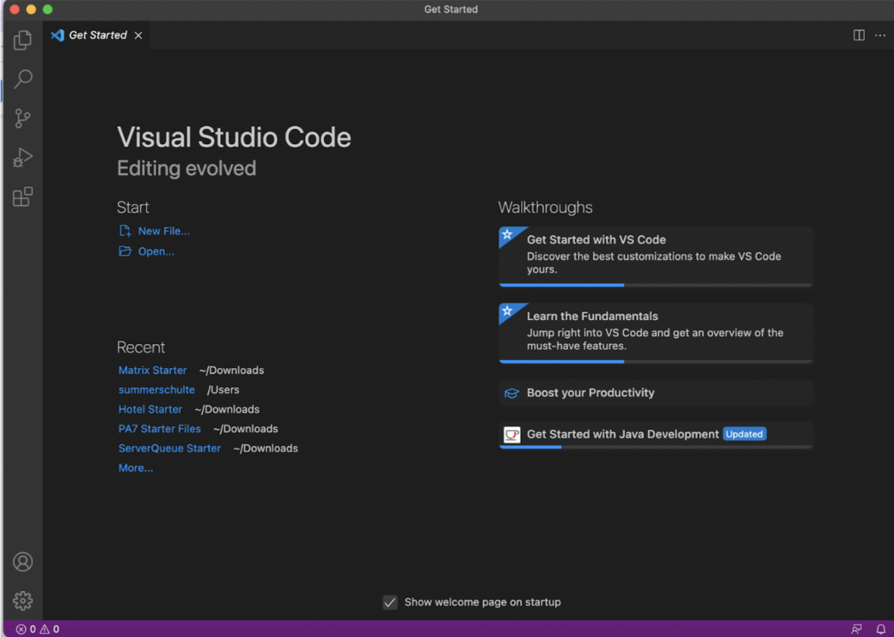
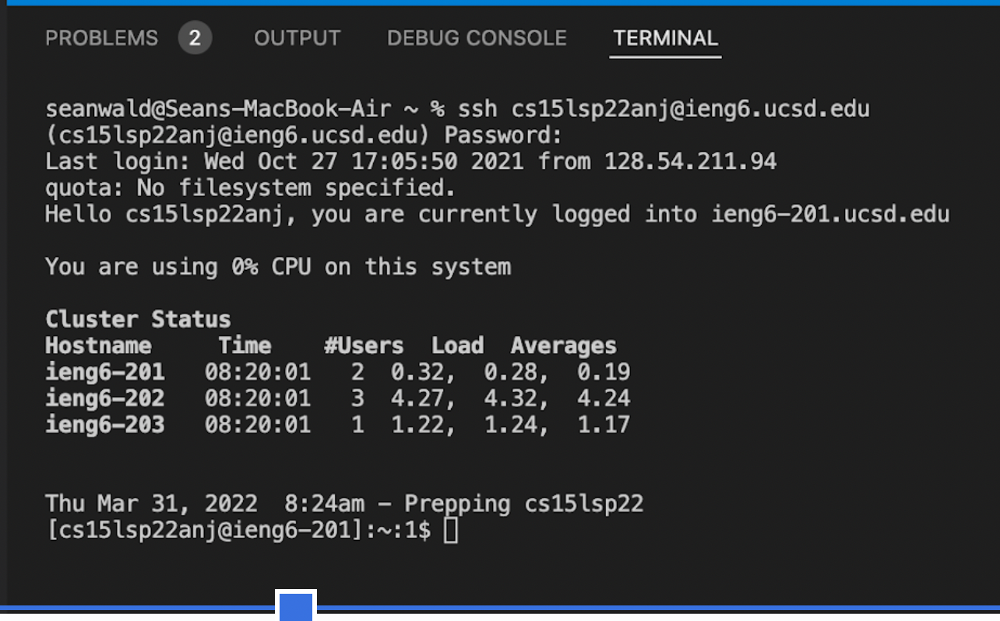
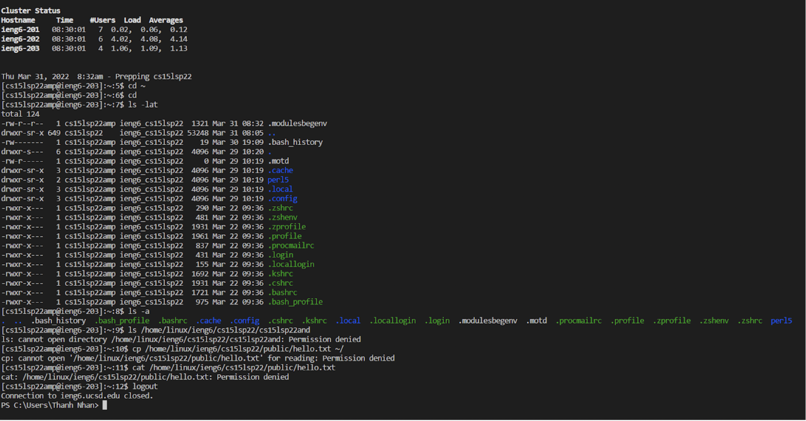
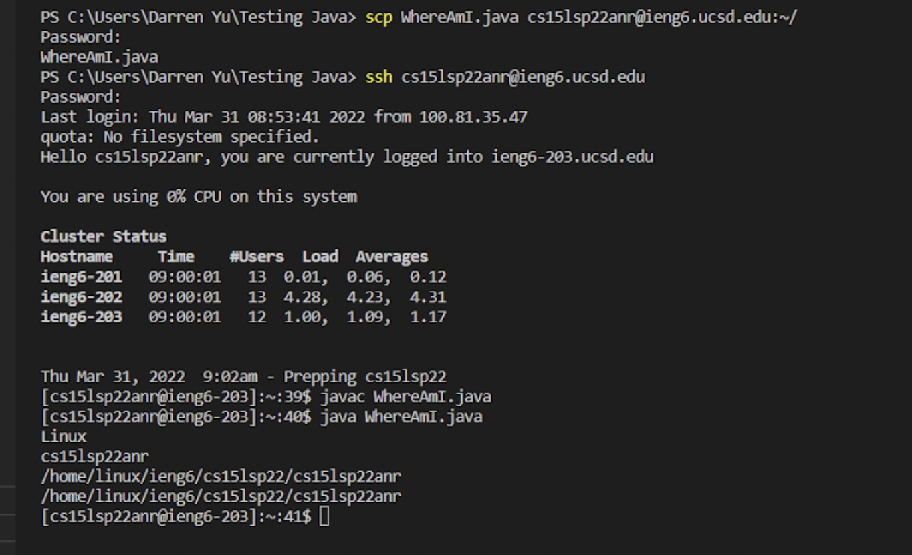
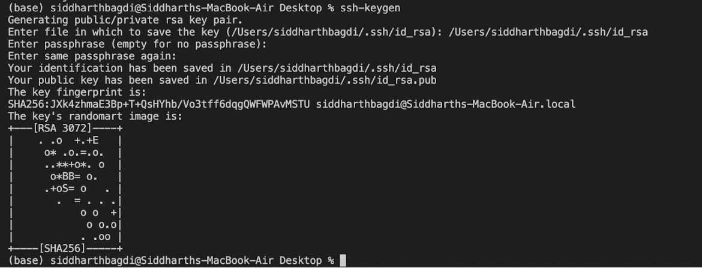

# How to Log Into Course-Specific ieng6 Account
## Step 1: Download **Visual Studio Code**
[This](https://code.visualstudio.com/) website will give directions on how to install VSC onto your computer. There are directions for all kinds of platforms (windows/mac) etc. 
https://summerschulte.github.io/summerschulte-cse15l-lab-reports/lab-report-1-week-2.md

## Step 2: Remotely Connecting
Connecting your machine to connect to a remote computer. This is important so that you can do work on multiple computers.
### Install **SSH**
[This](https://docs.microsoft.com/en-us/windows-server/administration/openssh/openssh_install_firstuse) website will give directions for installing SSH.

### Look up your account

[This](https://sdacs.ucsd.edu/~icc/index.php) website will have you login to your UCSD account and get your username.

### Open Visual Studio Code
- Open a terminal (Terminal -> New Terminal)
- Type "$ ssh cs15lsp22zz@ieng6.ucsd.edu" into the command line. *Replace* "zz" with your account letters.
- It will ask you a yes/no question about continuing since it is your first time connecting. Type *yes*.
- Enter your password.

It should look something like this:

We will call your computer the *client* and the computer in the lab the *server*.

## Step 3: Run Some Commands
We will now try running some basic commands and observe their output! It's okay if some cause errors, try to figure out why these instances occur.

Try these on your computer and the remote computer after ssh-ing:

- cd
- ls
- pwd
- mkdir
- cp

Observe the results.

Now try these!

- cd  ~
- cd
- ls -a
- ls </home/linux/ieng6/cs15lsp22/cs15lsp22abc>     Replace 'abc' with someone in your group's username.
- cp /home/linux/ieng6/cs15lsp22/public/hello.txt ~/
- cat /home/linux/ieng6/cs15lsp22/public/hello.txt

**Here is an example output**

---
### *To log out:* Ctrl-D

## Step 4: Moving Files over SSH with scp

This is an important step as you will learn how to *work remotely* and copy files between computers. This is useful because you may want to work both locally and remotely!

The command to do this is called **scp**. It will always be run from the *client* (your computer).

1. Create a file in your computer called **WhereAmI.java**

class WhereAmI {

    public static void main(String[] args) {
    System.out.println(System.getProperty("os.name"));
    System.out.println(System.getProperty("user.name"));
    System.out.println(System.getProperty("user.home"));
    System.out.println(System.getProperty("user.dir"));

    }

}

2.  Now run it using *javac *.java** and observe the output.

3. In the terminal and directory where you made this file, insert this command line but replace 'zz' with your username.         

  **scp WhereAmI.java cs15lsp22zz@ieng6.ucsd.edu:~/**

  You will be asked to put your password again. 

  4. Log back into ieng6 using ssh and run the *ls* command. This will display the WhereAmI file.

It should look something like this:
  

## Step 5: SSH Keys 

This is a great solution for the very repeptive task of putting in your password everytime you log in or use scp.

**ssh-kaygen** creates two files: the **public key** and **private key**.
The public key is copied into the server somewhere and the private key is copied somewhere into the client. The ssh command helps replace your password with these files. 

### To set it up, run this line in the terminal (not for Windows):
**ssh-keygen**

You will be prompted to type more into the terminal after this. 

It should look something like this:

### For windows, use this command:
**ssh-keygen -t ed25519**

Here, the private key is the file *id_rsa* and the public key is the file *id_rsa.pub*, all stored in the .ssh directory. 

### Now, copy the public key to the .ssh directory by using:

**$ ssh cs15lsp22zz@ieng6.ucsd.edu**

Now you can use ssh or scp instead of your password!

## Step 6: Optimizing Remote Running

Task: Use what we have learned so that you can best make any local edits to *WhereAmI.java* and copying it to the remote server and running it. 

Hint: Put a command in quotes at the end of the ssh command so that you can run it directly on the remote server. Also, using semicolons allows for you to run multiple comands on the same line. Use the up arrow in the terminal to recall previous commands. 

