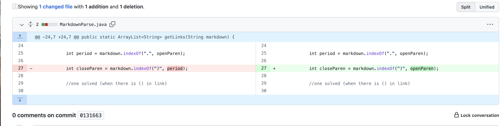
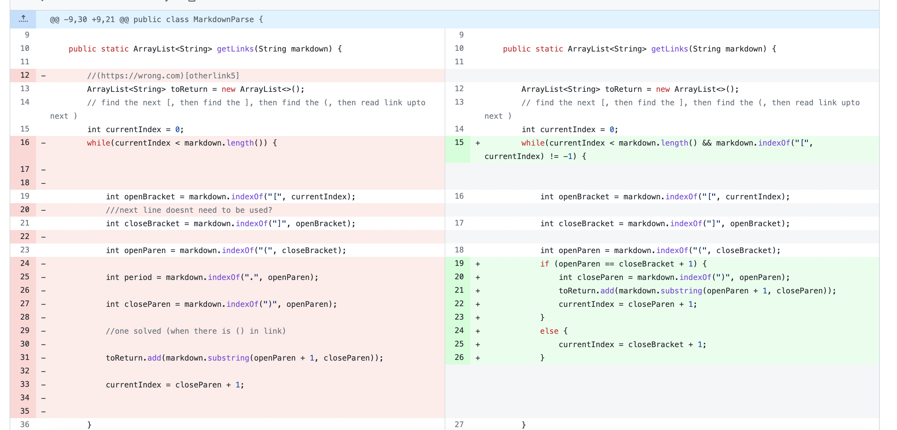

# Lab Report 2 Week 4

## Code Change #1:

This is the first changes I made in order to handle a file with parentheses in the link.

[This link](https://raw.githubusercontent.com/summerschulte/markdown-parser/main/newmarkdown.md) is the file with the contents that made me change to this code. 

### Symptom:
Exception in thread "main" java.lang.OutOfMemoryError: Java heap space

### Conclusion:
The OutOfMemory error is because of the parenthesis in the link. The original code was looking for the next closed parenthesis of the link but since there was an open and closed one already, the while loop kept running. This caused an infinite loop and made it run out of memory.
## Code Change #2:
For this test, I tried using a file that had no period in it.

The previous code was working for most files but I tried one that had no period. 

[This link](https://raw.githubusercontent.com/summerschulte/markdown-parser/main/test-file.md) is the link that contains the contents of what made me change my code. 
### Symptom:
Exception in thread "main" java.lang.OutOfMemoryError: Java heap space
### Conclusion:
Since I had fixed my code to deal with extra parenthesis, I was relying on the period on the link to help index. The symptom was caused because when there was no period in the link, the reference to closeParen would crash because it would search the whole line for the period but would run out of memory because it would keep running until it found it. 
## Code Change #3:
My code worked for the parenthesis issue but it did not work for when a file only had brackets in it.

[This link](https://raw.githubusercontent.com/summerschulte/markdown-parser/main/test1.md)  contains the contents of what was making it crash
### Symptom:
Exception in thread "main" java.lang.StringIndexOutOfBoundsException: begin 0, end -1, length 37
### Conclusion:
I was getting an error because of the previous code. The while loop was using the index of wherever the parenthesis were but since there were none in my code, the while loop would crash. 

