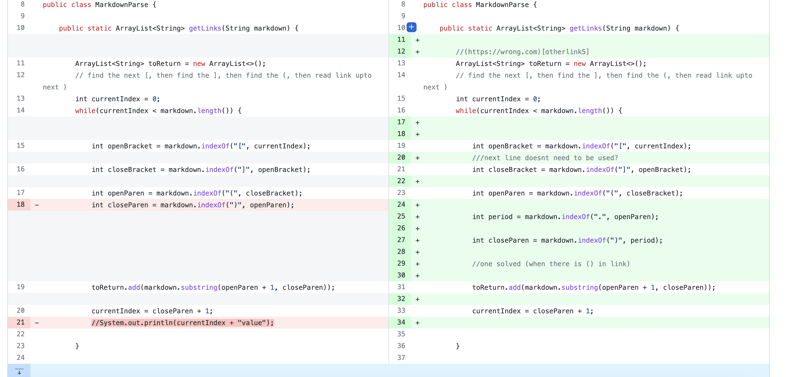

# Lab Report 2 Week 4

## Code Change #1:

This is the first changes I made in order to handle a file with parentheses in the link.

[This](https://raw.githubusercontent.com/summerschulte/markdown-parser/main/newmarkdown.md) is the file with the contents that made me change to this code. 

### Symptom:
Exception in thread "main" java.lang.OutOfMemoryError: Java heap space

### Conclusion:
The OutOfMemory error is because of the parenthesis in the link. The original code was looking for the next closed parenthesis of the link but since there was an open and closed one already, the while loop kept running. This caused an infinite loop and made it run out of memory.

## Code Change #2: