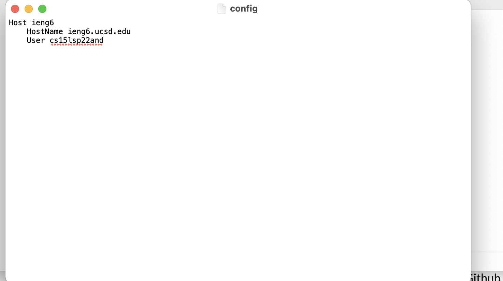

# Lab Report 3 Week 6
## **Streamlining ssh Configuration**
Here, we will learn how configuration files can be used to make the process of logging into servers easier.

**Step 1:** Open up or create a <code> ~/.ssh/config </code> file.

- You can do this in any text editor.
- Make sure that it is in your ssh directory.

**Step 2:** Add the following lines into the file.

<code>

    Host ieng6
        HostName ieng6.ucsd.edu
        User cs15lsp22zzz (use your     username)
</code>

The file will look something like this:

**Step 3:** Run the command <code> ssh ieng6 </code> 

Like this:

Now, we can even try copying files into your account using *scp*!

## **Setup Github Access from ieng6**

My public key is stored on GitHub and I was able to see it through the command **ls**

I was able to add it to GitHub here:

Now, we can commit and push by using these keys

## **Copy Whole Directories with <code> scp </code>** 

Start off by copying your markdown directory into the ieng6 account 

Now we will log into our ieng6 account and compile the files 

Lastly, combining ssh and scp, ; to copy the whole directory 

