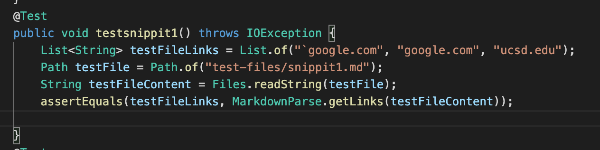
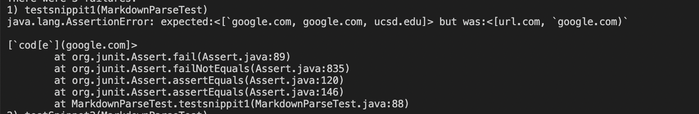
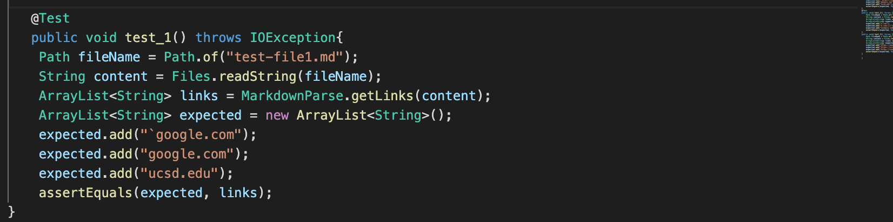
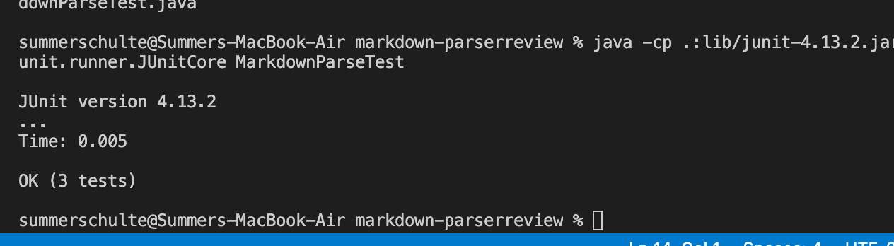
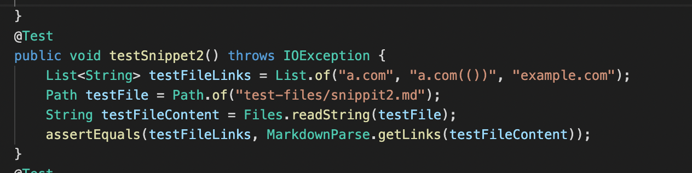
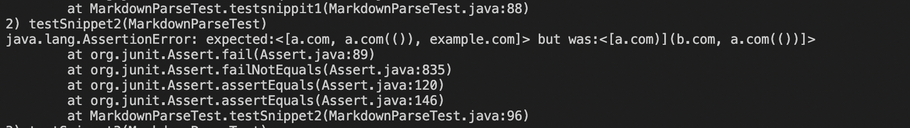
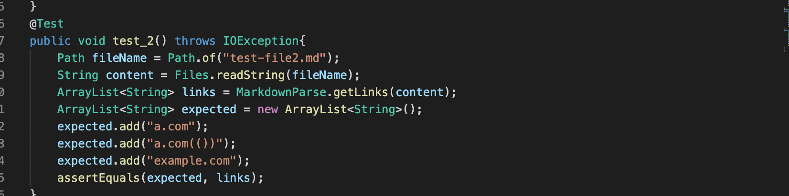
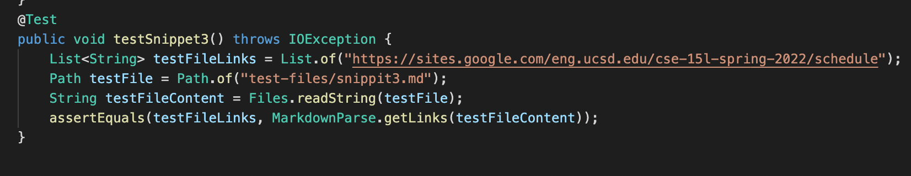
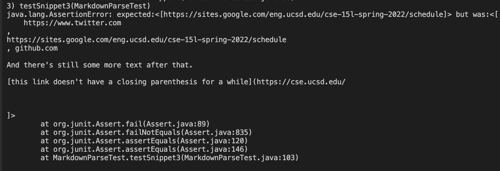
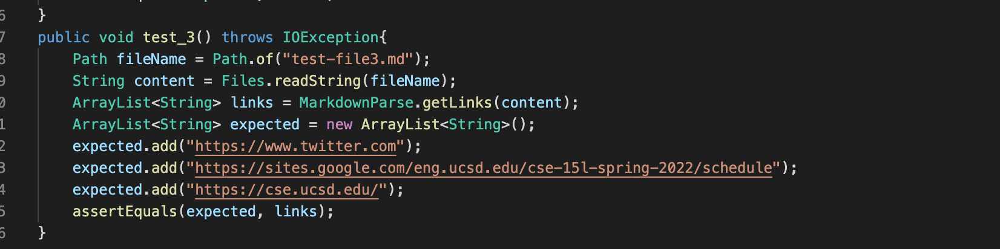

# Lab Report 4 Week 8
Here, we will be reviewing the markdown tests on 2 versions of MarkdownParse.java for 3 different files. 

- [Here](https://github.com/summerschulte/markdown-parser) is the link for **my** markdown-parse repository 

- [Here](https://github.com/NuojinliXu/markdown-parser) is the link for the **reviewed** markdown-parse repository

---

## **Snippet 1**
The expected output for this should be:

     [`google.com, google.com, ucsd.edu]

### Testing using `my implimentation`
To test it I created this code:

Here are the results (failed):

### Testing using the `reviewed implimentation`

To test it I created this code:

Here are the results (passed):

---
## **Snippet 2**

The expected output for this should be:

     [a.com, a.com(()), example.com]

### Testing using `my implimentation`

To test it I created this code:

Here are the results (failed):

### Testing using the `reviewed implimnetation`

To test it I created this code:

Here are the results (passed):

---

## **Snippet 3**

The expected output for this should be:

    [https://sites.google.com/eng.ucsd.edu/cse-15l-spring-2022/schedule]

### Testing using `my implimentation`

To test it I created this code:

Here are the results (failed):

### Testing using the `reviewed implimentation`

Here are the results (passed):

---

## Questions
1) Do you think there is a small (<10 lines) code change that will make your program work for snippet 1 and all related cases that use inline code with backticks? If yes, describe the code change. If not, describe why it would be a more involved change.

    - No, I don't think there is a small code change for my program that will make snippet 1 work. I would have to write a new function that can track and recognize backticks as well as the brackets inside of the backticks. 
2) Do you think there is a small (<10 lines) code change that will make your program work for snippet 2 and all related cases that nest parentheses, brackets, and escaped brackets? If yes, describe the code change. If not, describe why it would be a more involved change.
    
    - Yes, I do think I can make some small changes to my program that could solve snippet 2. The problem here was that there were brackets and parethesis inside of brackets. So, if I could add code that could check inside of the closed bracket for either of these, I could return that link. 
3) Do you think there is a small (<10 lines) code change that will make your program work for snippet 3 and all related cases that have newlines in brackets and parentheses? If yes, describe the code change. If not, describe why it would be a more involved change.

    - Yes, I do think I can make some small changes to my program that could solve snippet 3. This file contains similar formatting to what my current program can solve except there are lots of lines and blank spacing. I could change my code to looking for the next character rather than looking directly at the next index in the string. 

---

