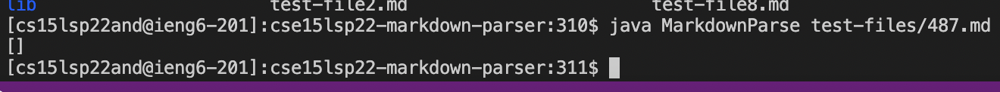
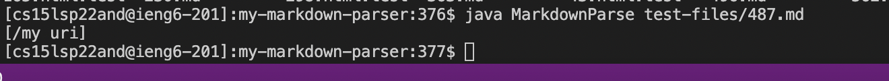
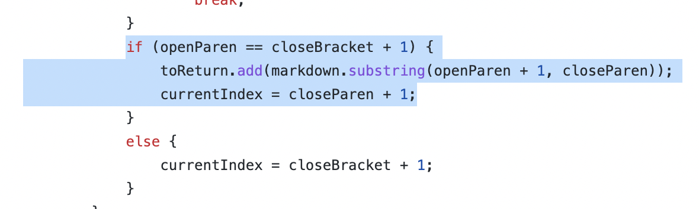
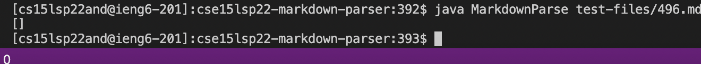
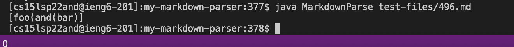

# **Lab Report 5**

## Finding the Tests:

I was able to find the tests that had different results by using `vimdiff`. This did a comparsion of each test result and highlighted which were different. 

Here, I found multiple test files that contined different results but only chose two: Tests **`487.md and 496.md`**

[Here is the link for 487.md.](https://github.com/nidhidhamnani/markdown-parser/blob/main/test-files/487.md)

[Here is the link for 496.md.](https://github.com/nidhidhamnani/markdown-parser/blob/main/test-files/496.md)

## Test 487.md:
To decide which implementation is correct, I used the CommonMark demo site. For this test, the correct output should be 

    []

### Output from other implementation
*(Correct Output)*

### Output from my implementation
*(Incorrect Output)*

### What the bug is:

The code below is what I believe to be the bug for this test file. The problem was that my code is just checking to see if theres an open parenthesis right after the closed bracket. It did not check for whether or not there were spaces in the 'link'.

## Test 496.md
To decide which implementation is correct, I used the CommonMark demo site. For this test, the correct output should be

    []

### Output from other implementation
*(Correct Output)*

### Output from my implementation
*(Incorrect Output)*

### What the bug is:

The code below is what I believe to be the bug for this test file. The problem was that my code isn't checking for other parenthesis besides the closing one. 

